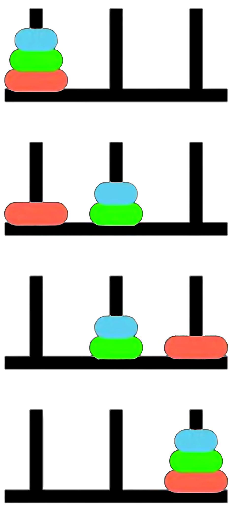
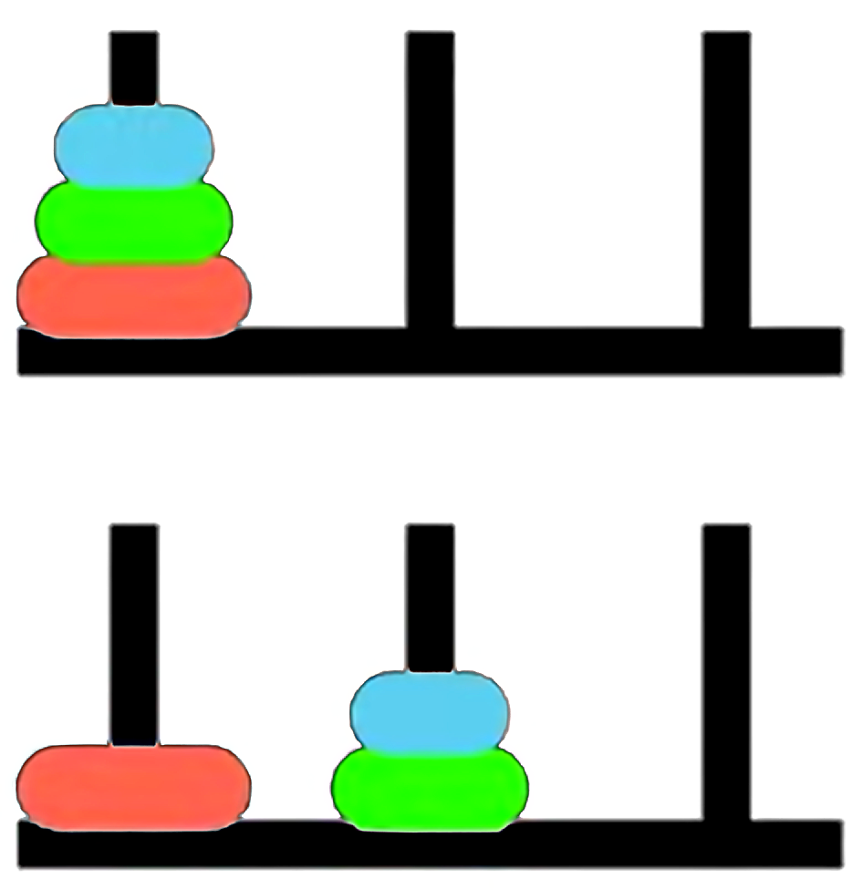

::: {.content-visible when-profile="book"}

## Slides

This module is also available in the following versions

- [slides (html)](slides/talk.html)
- [slides (pdf)](pdfs/talk.pdf)

:::

# Talk Introduction

## Synthetic Relativity: Tri-modality and the Fixpoint Semantics of the Logical Observer 

Adrian R. Pearce

School of Computing and Information Systems

The University of Melbourne

# The situation calculus

## The situation calculus (Towers of Hanoi)

::: {.columns}
::: {.column width="40%"}
{height=47% width=47% fig-align="center"}
:::
::: {.column width="60%"}
::: {.shrink75}

[Fluents:]{style="color:blue"} $\mathit{OnPeg}(d, p, s)$

[*Initial Situation:*]{style="color:blue"}

$$
\begin{align*}
& \mathit{OnPeg}(D_1, Peg_1, S_0) \land \\
& \mathit{OnPeg}(D_2, Peg_1, S_0) \land \\
& \mathit{OnPeg}(D_3, Peg_1, S_0) 
\end{align*}
$$

[*Actions:*]{style="color:blue"} $move(d, p_{from}, p_{to})$

[*Goal:*]{style="color:blue"} All disks on $Peg_3$.

:::
:::
:::

## Reiter's Induction Axiom

::: {.callout-note icon=false title="The Foundational Induction Axiom: Second Order"}

  $$ \forall P.\,[P(S_0) \land \forall a,s\,(P(s)\to P(do(a,s)))]\to \forall s\,P(s) $$

- Every valid situation is mathematically guaranteed to be a finite sequence of actions rooted at $S_0$.
- Establishes the situation domain as an **inductive** datatype.
- Note that standard first order logic cannot enforce reachability due to the Compactness Theorem.
:::

## Situations & Actions

{height=25% width=25% fig-align="center"}

::: {.shrink65}

$$
\begin{align*}
\mathit{Initial\;situation:}\;& S_0 \\
 & do(move(D_1, Peg_1, Peg_3), S_0) \\
do(move(D_2, \mathit{Peg}_1, \mathit{Peg}_2),\;& do(move(D_1, Peg_1, Peg_3), S_0)) \\
do(move(D_1, \mathit{Peg}_3, \mathit{Peg}_2), do(move(D_2, \mathit{Peg}_1, \mathit{Peg}_2),\;& do(move(D_1, Peg_1, Peg_3), S_0)) \\
& \ldots
\end{align*}
$$
:::

## Situations as a Least Fixpoint

::: {.shrink70}

Let $\mathcal{A}$ be actions and $\mathcal{S}$ be the universe of situations. Define a monotonic operator $\Gamma$:
$$ \Gamma(X) = \{S_0\} \cup \{ do(a, s) \mid a \in \mathcal{A}, s \in X \} $$

From the **Second-Order Induction Axiom**:

- **The Premise:** $P(S_0) \land \forall a,s\,(P(s)\to P(do(a,s)))$ translates to $\Gamma(P) \subseteq P$. 
  Here, $P$ is a **pre-fixed point** *(an over-approximation that obeys the rules, but may contain unreachable "junk" like ghost situations or disconnected time loops).*
- **The Consequent:** $\forall s\,P(s)$ asserts that the true universe of situations $\mathcal{S}$ is a subset of $P$.
- The axiom combines these, stating $\mathcal{S}$ is a subset of *every* valid pre-fixed point. Taking their intersection mathematically acts as a sieve, filtering out all the unshared, unreachable junk.
:::

## Situations as a Least Fixpoint (continued)

::: {.callout-note icon=false title="The Knaster-Tarski Theorem: least fixpoint"}
The intersection of all **pre-fixed** points of a monotonic operator yields its **least fixpoint**. 

Therefore, the Second-Order Induction Axiom rigorously enforces 

$$\mathcal{S} = \mu X.\Gamma(X)$$

*Leaving only the pure, minimal valid tree.*
:::

## Syntactic transformation to First Order Logic 

::: {.shrink68}

**Basic Action Theories** [Lin and Reiter 94] define Theory 

$$\mathcal{D} = \Sigma \cup \mathcal{D}_{S_0} \cup {\color{blue}{\mathcal{D}_{Poss}}} \cup {\color{blue}{\mathcal{D}_{SSA}}} \cup \mathcal{D}_{UNA}$$

* $\color{blue}{\mathcal{D}_{poss}}$: axioms describing the prerequisites of the primitive actions, of the form:

  $$
  Poss(A(\vec{x}), s) \equiv \Theta_A(\vec{x}, s),
  $$
  one for each primitive action $A$.

$$
\begin{align*}
Poss(move(d, p_{from}, p_{to}), s) \equiv \;& Disk(d) \land (p_{from} \neq p_{to}) \land OnPeg(d, p_{from}, s) \land \\
& \neg \exists d' \Big( Disk(d') \land Smaller(d', d) \land \\
& \big( OnPeg(d', p_{from}, s) \lor OnPeg(d', p_{to}, s) \big) \Big)
\end{align*}
$$

:::

## A solution to the frame problem ([sometimes]{style="color:blue"}) [Reiter 91]

::: {.shrink70}

* $\color{blue}{\mathcal{D}_{ssa}}$: axioms describing the effects and non-effects of actions, of the form $F(\vec{x}, do(a, s)) \equiv \psi_F(\vec{x}, a, s),$ one for each fluent $F$. 

1. Positive effect axioms:

$$
\exists p_{from} \ (a = move(d, p_{from}, p)) \supset OnPeg(d, p, do(a, s))
$$

2. Negative effect axioms:

$$
\exists p_{to} \ (a = move(d, p, p_{to})) \supset \neg OnPeg(d, p, do(a, s))
$$

3. Frame axioms:

$$
OnPeg(d, p, s) \land \neg \exists p_{to} \ (a = move(d, p, p_{to})) \supset OnPeg(d, p, do(a, s))
$$

4. Completeness assumption ([explanation closure]{style="color:blue"}):

$$
\neg OnPeg(d, p, s) \land OnPeg(d, p, do(a, s)) \supset \exists p_{from} \ (a = move(d, p_{from}, p))
$$

$\color{blue}{\mathcal{D}_{ssa}}$ $=$ positive effect axioms $+$ negative effect axioms $+$ frame axioms $+$ [completeness assumption]{style="color:blue"}

:::

## Successor State Axioms 

::: {.shrink75}

Suppose that for fluent $F(\vec{x}, s)$:  
$\gamma_F^+(\vec{x}, a, s)$ encodes all *positive* effects; and  
$\gamma_F^-(\vec{x}, a, s)$ encodes all *negative* effects.

The successor state axiom solution has the following form:

$$
\color{blue}{F(\vec{x}, do(a, s)) \equiv \gamma_F^+(\vec{x}, a, s) \lor F(\vec{x}, s) \land \neg \gamma_F^-(\vec{x}, a, s)}
$$

In our example:

$$
\begin{align*}
\gamma_{OnPeg}^+(d, p, a, s) \;&\stackrel{\text{def}}{=}\; \exists p_{from} \ (a = move(d, p_{from}, p)) \\
\gamma_{OnPeg}^-(d, p, a, s) \;&\stackrel{\text{def}}{=}\; \exists p_{to} \ (a = move(d, p, p_{to}))
\end{align*}
$$

So successor state axiom is:

$$
\begin{align*}
OnPeg(d, p, do(a, s)) \equiv \;& [\exists p_{from} \ (a = move(d, p_{from}, p))] \lor \\
& OnPeg(d, p, s) \land \neg [\exists p_{to} \ (a = move(d, p, p_{to}))]
\end{align*}
$$

:::

## Regression 
::: {.shrink65}

The **regression operator** ($\mathcal{R}$) evaluates a query about a future state by pushing it backward in time. 

$$
\mathcal{R}[{\color{blue}{F(\vec{x}, do(a, s))}}] \;\stackrel{\text{def}}{=}\; \gamma_F^+(\vec{x}, a, s) \lor {\color{blue}{F(\vec{x}, s)}} \land \neg \gamma_F^-(\vec{x}, a, s)
$$

[*For Example: is $D_2$ on $Peg_2$ after we move $D_1$ from $Peg_1$ to $Peg_2$?*]{style="color:blue"}

**1. Apply $\mathcal{R}$ to the query:**

$$
\mathcal{R}[\, OnPeg(D_2, Peg_2, do({\color{red}{move(D_1, Peg_1, Peg_2)}}, S_0)) \,]
$$

**2. Syntactic substitution (using our SSA):**

$$
\begin{align*}
\equiv \;& [\exists p_{from} \ ({\color{red}{move(D_1, Peg_1, Peg_2)}} = move(D_2, p_{from}, Peg_2))] \lor \\
& {\color{blue}{OnPeg(D_2, Peg_2, S_0)}} \land \neg [\exists p_{to} \ ({\color{red}{move(D_1, Peg_1, Peg_2)}} = move(D_2, Peg_2, p_{to}))]
\end{align*}
$$

**3. Evaluate using Foundational Axioms ($\mathcal{D}_{una}$):**
Because our Unique Names Axioms explicitly state $D_1 \neq D_2$, both action equivalences mathematically evaluate to $False$:

$$
\equiv \mathrm{False} \lor {\color{blue}{OnPeg(D_2, Peg_2, S_0)}} \land \neg \mathrm{False}
$$

**4. Logical Result:**

$$
\equiv {\color{blue}{OnPeg(D_2, Peg_2, S_0)}}
$$

:::

## Foundational Limitations of Least Fixpoints?

::: {.shrink70}
While classical induction successfully builds a valid history, enforcing this rigid geometry creates severe structural limits for dynamic, self-reflective systems:

*   **Strict Tree Topology ([Unique Predecessors]{style="color:blue"}):** Distinct action histories never converge. Even if two different paths result in the same state, the logic traps them in isolated parallel universes.
*   **Total Ordering ([The Self-Reflection Barrier]{style="color:blue"}):** The strictly linear sequence of actions restricts true partial ordering and concurrency. The logic cannot step "outside" the sequence to self-reflect or re-evaluate its overarching reference frame.
*   **No Native State Equivalence:** Because states are strictly defined by their rigid *syntactic history* rather than their *observable behaviour*, [the topology cannot naturally "fold" or quotient identical states together.]{style="color:blue"}
*   **The Finiteness Barrier:** By mathematical definition, a least fixpoint ($\mu$) only constructs strictly *finite* chains. [It is blind to infinite, continuous processes]{style="color:blue"}.
:::

## Property Persistence as a Greatest Fixpoint

::: {.shrink68}

Property persistence in the situation calculus captures a condition $\phi$ that holds *now* and is preserved after *any legal action* via regression ($\mathcal{R}$).

[Kelly & Pearce AIJ 2010] define this as the **Persistence operator** ($\mathcal{P}$):

$$ \mathcal{P}(Z) \equiv \phi(s) \land \forall a \big( \textit{Poss}(a, s) \to \mathcal{R}[\, Z(do(a, s)) \,] \big) $$

[Iteratively applying this meta-level calculation computes the maximal invariant without explicitly invoking the second-order induction axiom.]{style="color:blue"}

- By wrapping the single-step regression operator $\mathcal{R}$ inside a monotonic formula transformer ($\mathcal{P}$), the future can be evaluated back in the current state. 

:::

::: {.callout-note icon=false title="The Syntactic Limit: Greatest Fixpoints ($\nu Z$)"}
- Property persistence is an infinite-horizon **safety property**.
- The persistence condition is the **greatest fixpoint** of this operator: $\nu Z.\, \mathcal{P}(Z)$.
- *The Problem:* [Regression builds finite states. To syntactically evaluate this infinite fixpoint, we must shift our mathematical framework.]{style="color:blue"}
:::

# Category Theory

## The Dual Problems: Algebras & Coalgebras 

::: {.shrink68}

To transition from finite histories to observing infinite Greatest Fixpoints, we harness **Category Theory**. An *endofunctor* ($F$) over a state space ($S$) is a structural template that shapes the resulting data object, $F(S)$.

* **Algebra (Situation Calculus / Constructor):** Morphism arrows point *inward*: $\; F(S) \to S$
  * Our endofunctor shapes the inputs: $F(S) = Action \times S$
  * The *morphism* evaluates to: ${\color{blue}{(Action \times State_{current}) \to State_{next}}}$
  * *Concept:* [*Construct* a history from the bottom-up.]{style="color:blue"}

* **Coalgebra (Property Persistence / Observer):** Morphism arrows point *outward*: $\; S \to F(S)$
  * Our endofunctor shapes the emitted data: $F(S) = Observation \times S$
  * The morphism evaluates to: ${\color{blue}{State_{current} \to (Observation \times State_{next}}})$
  * *Concept:* [Take a running state, break off an *observation*, and unfold the remaining state into the future.]{style="color:blue"}

:::

## Categorical Proof Techniques: Coinduction & Stone Duality

::: {.shrink72}

To reason about infinite streams when operating in *coalgebras*, we harness two categorical proof mechanisms.

**1. Coinduction (The Dual of Induction)**
While standard induction proves a finite base case and builds upward, coinduction works top-down. It *proposes* a Greatest Fixpoint (an infinite rule, $\nu Z$) and verifies it locally. 

*If the observation holds right now, and the rules guarantee it holds in the next step, the Greatest Fixpoint is guaranteed to hold forever.*

**2. Stone Duality (Syntax-Semantics)**
In Category Theory, **Stone Duality** dictates an duality between Syntax (logical formulas) and Semantics (topological state space). 

* [*The Syntactic Transformation:* If our logic formally declares two distinct observational paths to be identical (Bisimulation Equivalence) $\ldots$]{style="color:blue"}
* [$\ldots$ *The Semantic Result:* Stone Duality guarantees the underlying semantic space automatically folds (quotients) to make those paths topologically identical.]{style="color:blue"}

:::

## Example: Coinduction in Towers of Hanoi

{height=8% width=8% fig-align="center"}

::: {.shrink75}

IF we observe the *relative movement* of the smallest disk $D_1$ (alternating moves with $D_2$ or $D_3$) on $\mathit{OnPeg}(d,p,s)$: 

$$ \Delta p \equiv (p_{to} - p_{from}) \pmod 3 $$

**1. The Coalgebraic Stream:** Solving the puzzle generates an infinite stream of spatial jumps: 

$$ \langle +2 \rangle, \langle -1 \rangle, \langle -1 \rangle, \langle +2 \rangle \dots $$

**2. The Coinductive Proposal:** We propose an idealised Greatest Fixpoint where the disk *always* cycles left:

$$ ParityInvariant \equiv \nu Z.\ \langle -1 \rangle Z $$

:::

## Example: Coinduction in Towers of Hanoi (Continued)

::: {.shrink75}

**3. The Coinductive Step (Bisimulation):** 
Following $+2$, the stream outputs a jump of $-1$. [How does our *proposed invariant* survive this paradox?]{style="color:blue"}

To satisfy the local coinductive check, the logic evaluates the domain's geometry. It formally recognises that jumping right twice ($+2$) is structurally indistinguishable from jumping left once ($-1$). It applies this coinductive equivalence:

$$ \forall \phi.\ \langle +2 \rangle \phi \;\equiv\; \langle -1 \rangle \phi $$

**4. The Stone Duality Resolution:**
By syntactically equating these propositions, **Stone Duality** automatically forces the absolute state space to fold into a modulo-3 *quotient ring* ($\mathbb{Z}_3$)!

[This is our new syntactic transformation!]{style="color:blue"}

:::

# Synthetic relativity axioms

## Tri-modality & ternary representation

::: {.shrink85}

Logical entailment operates within a **Total Category**—a mathematically complete Stone Duality glues syntax and semantics together.

It is evaluated relative to a specific baseline **Reference Frame**, $\mathrm{S_f}$. This facilitates the rules and symmetries over which the observer's duality is constructed. 

- It utilises a ternary structure, drawing from **Routley-Meyer semantics** for substructural, relevance, and intuitionistic logics, involving relations $R(x, y, \mathrm{S_f})$.
- This allows us to decouple the synthetic (axiomatic) transformations from the topological space. 

:::

## Synthetic Relativity Axioms

::: {.shrink75}

The space is governed by three interacting modalities.

*   **${\color{blue}{\mathrm{RDo}}}$ (The Subproblem / Syntax): The Inductive Accumulator ($\Box_1$)**
    Operates in constructive, non-Boolean logic. Recursively gathers finite, computationally observable properties (compact elements) along a directed logical path. 
*   **${\color{blue}{\mathrm{ODo}}}$ (The Master Problem / Semantics): The Limit/Creator Modality ($\Box_2$)**
    The semantic evaluator and *interval invariant*. 

*Performs topological closure—evaluating the directed set generated by $\mathrm{RDo}$ and snapping it into a discrete, continuous limit.*

*   **${\color{blue}{\mathrm{PDo}}}$ (Autonomous Progression): The Dynamic Transition Functor ($\Box_3$)**
    The transition modality that governs the forward evolution of the system. 

*Mathematically, it acts as an endofunctor within the Total Category, orchestrating the step-by-step recursive interaction (categorical adjunction) of local syntax ($\mathrm{RDo}$) and global semantics ($\mathrm{ODo}$) relative to $S_f$.*

:::

## Constructive Accumulation

::: {.callout-note icon=false title="Axiom 1: The Axiom of Constructive Accumulation"}
The Dynamic Transition Functor ($\mathrm{PDo}$) governs the autonomous progression of the system via a strict recursive transition law relative to the Reference Frame ($S_f$):

* **Base Case (Initialisation):** Let $S_r^{(0)}$ and $S_o^{(0)}$ be the initial states.
  $$ \Sigma_0 = \mathrm{PDo}\big(S_r^{(0)},\; S_o^{(0)},\; S_f\big) $$
* **Successor Rule (Inductive Step):** For any step $n \ge 0$, the next state strictly nests new inductive syntax ($\mathrm{RDo}$) and semantic coinduction ($\mathrm{ODo}$):
  $$ \Sigma_{n+1} = \mathrm{PDo}\Big(\, \mathrm{RDo}\big(R_{n+1}, S_r^{(n)}\big),\; \mathrm{ODo}\big(O_{n+1}, S_o^{(n)}\big),\; S_f \,\Big) $$
:::

## Constructive Accumulation (continued)

::: {.shrink75}

Unrolling this recursive law mathematically generates an endlessly nested trace of accumulating evidence:

$$ \mathrm{PDo}(S_r, S_o, S_f) $$

$$ \mathrm{PDo}\big(\, \mathrm{RDo}(R_1, S_r),\; \mathrm{ODo}(O_1, S_o),\; S_f \,\big) $$

$$ \mathrm{PDo}\Big(\, \mathrm{RDo}\big(R_2, \mathrm{RDo}(R_1,S_r)\big),\; \mathrm{ODo}\big(O_2, \mathrm{ODo}(O_1,S_o)\big),\; S_f \,\Big) \dots \mathit{etc.} $$

*"Relative to reference frame $S_f$, the accumulation of inductive evidence $\mathrm{RDo}$ yields the coinductively realised semantic limit $\mathrm{ODo}$."*
:::

## Semantic Realisation

::: {.callout-note icon=false title="Theorem I: Semantic Realisation"}
**Semantic Realisation** is the mathematical state where syntax and semantics converge. Because the logic builds upon finite, verifiable observables, autonomous progression halts when the topology reaches Algebraic Compactness:

$$ \mu (\mathrm{PDo}) = \mathrm{ODo} \left( \bigsqcup_{i \in R} \mathrm{RDo}_i(\bot) \right) $$

- **$\bigsqcup \mathrm{RDo}$ (Syntax):** [By induction builds a raw chain of evidence from the ground up.]{style="color:blue"}
- **$\mathrm{ODo}$ (Semantics):** [The top-down evaluator reads the syntax trace and evaluates its truth value.]{style="color:blue"}

**Proof Sketch:** Corresponds to the computation of the **Kleene Fixed-Point Theorem** $+$ **Algebraic Compactness** (next slide).

:::

## The Dual Fixpoints: Algebraic Compactness

::: {.shrink66}

**Unifying Reachability ($\mu$) & Persistence ($\nu$):** By intertwining syntax ($\mathrm{RDo}$) and semantics ($\mathrm{ODo}$), the dynamic transition functor ($\mathrm{PDo}$) mathematically fuses two distinct forms of logical progression:

1.  **Induction / Least Fixpoint ($\mu$):** Governed by the $\mathrm{RDo}$ modality. The bottom-up synthesis of finite evidence from baseline ignorance ($\bot$). It guarantees computational *Reachability*.
2.  **Coinduction / Greatest Fixpoint ($\nu$):** Governed by the $\mathrm{ODo}$ modality. The top-down evaluation of continuous semantics. It guarantees *Safety and Property Persistence*.

:::

::: {.callout-note icon=false title="Theorem II: Algebraic Compactness"}
Because **Theorem I (Semantic Realisation)** formally computes a categorical *bilimit*, the system achieves algebraic compactness. [At convergence, the initial algebra of the dynamic transition functor coincides with its final coalgebra:]{style="color:blue"}

$$ \mu(\mathrm{PDo}) \cong \nu(\mathrm{PDo}) $$

*The active inductive trace ($\mu$) strictly fulfills the persistent semantic invariant ($\nu$).*
:::

## The Synthetic Transformation

::: {.callout-note icon=false title="Axiom 2: The Axiom of Synthetic Transformation"}
Once Realisation is achieved, the relativistic reference frame mathematically shifts. The categorically preserved invariant (the semantic limit, ${\color{blue}{O}}$) becomes the new reference frame ($S_f$) for the next order of progression.

$$ \mathrm{PDo}(N, {\color{blue}{O}}, S_f) \longrightarrow \mathrm{PDo}(X, Y, {\color{blue}{O}}) $$

*   **Left Side:** The realised state computed within the initial reference frame ($S_f$).
*   **The Arrow ($\longrightarrow$):** The Synthetic Transformation (Topological closure and categorical Change of Base).
*   **Right Side:** A new, higher-order autonomous progression begins. 

[The semantic limit $O$ has mathematically synthesised into an syntactic, discrete baseline Reference Frame $S_f$ for the new subproblem ($X$).]{style="color:blue"}
:::

## Towers of Hanoi example

::: {.shrink70}

**1. Local Unrolling (Building the Situation Trace):** 
The logic recursively accumulates primitive actions [(moving disks)]{style="color:blue"}, generating the topological equivalent of a nested $do()$ sequence:

$$ \mathrm{PDo}\Big(\, \mathrm{RDo}\big({\color{blue}{\text{move}(D_1, P_2)}}, \dots S_f\big),\; \mathrm{ODo}\big(O_{\text{target}}, \text{Goal}\big),\; S_f \,\Big) $$

**2. Limit Catching:** 
Through top-down semantic reflection ($\Box_2$), the $\mathrm{ODo}$ modality mathematically coinduces a structural property of the optimal traces: [The Parity Invariant ($O_{\text{parity}}$).]{style="color:blue"}

**3. The Synthetic Transformation (Change of Base):** 
The Transformation Axiom fires, executing a categorical Change of Base:

$$ \mathrm{PDo}(N_{\text{trace}}, {\color{blue}{O_{\text{parity}}}}, S_f) \longrightarrow \mathrm{PDo}(X, Y, {\color{blue}{\mathrm{O_{\text{parity}}}}}) $$

The invariant (cycle $D_1$, alternate move, cycle $D_1$) emerges as the unique, strictly positive proof path through the state space.

- The new parity invariant shifts to become the Reference Frame. By adopting this rule as a **lifted axiom**, *the search tree branching factor strictly collapses from 3 down to 1.*

:::

# Relativistic Domain Theory in Logical Form (R-DTLF)

## DTLF Logical Primitives---No negation or implication

::: {.shrink60}
We ground our system in Abramsky’s **DTLF** (1991) based on an **intuitionistic** construction of truth, since we require a logic that fuses [classical (inductive) logic with intuitionistic (coinductive) logic]{style="color:blue"}. DTLF formulas represent observable properties as they unfold, and because the system can only assert what it can finitely verify, the baseline syntax is strictly positive.

$$ \phi, \psi  ::=  \top  \mid  \bot  \mid  \phi \land \psi  \mid  \phi \lor \psi  \mid  \text{Constructors}(\phi) $$

* **$X, Y$ (Variables):** Placeholders used to define recursive logical properties.
* **$\top$ (True / Top):** The trivial observation (a valid transition occurred). **$\bot$ (False / Falsum):** The null observation (a paradox occurred)---The baseline ignorance from which new inductive proofs begin.
* **$\phi \land \psi \ / \ \phi \lor \psi$ (Conjunction / Disjunction):** "I simultaneously observe both $\phi$ and $\psi$" / "I observe either $\phi$ or $\psi$."
* **$\langle \delta \rangle \phi$ (The Coalgebraic Transition Modality):** This is the literal "arrow breaking in two." It reads: *"The system makes a visible relativistic jump of $\delta$ (where $\delta \in \mathbb{Z}$), and the continuing, unobserved future stream will satisfy property $\phi$."* [Because this evaluates future observation rather than past history, it serves as the formal logical engine for bisimulation and state-folding.]{style="color:blue"}

* **$\mu X.\ \Phi(X)$ / $\nu X.\ \Phi(X)$ (Least & Greatest Fixpoints):** The primitives for recursive behaviour. [$\mu$ drives finite, bottom-up induction from baseline ignorance (reachability), while $\nu$ defines an endlessly repeating, top-down coinductive stream (persistence).]{style="color:blue"}

:::

## Example: Computing the Hanoi Parity Invariant

::: {.shrink70}

We can now express our hypothesis for the Towers of Hanoi in DTLF. 

[*We co-induce an idealised invariant in DTLF where the smallest disk flawlessly cycles one peg to the left ($-1$) forever.* ]{style="color:blue"}

**1. Proposing the Idealised Rule:**
We propose this property as our Greatest Fixpoint:

$$
ParityInvariant \equiv \nu X.\ \langle -1 \rangle X
$$

**2. The Reality:**
However, the puzzle generates a stream that forces a forward jump of $+2$ from $Peg_1$ back to $Peg_3$. The observable bounds are:

$$
Observed \equiv \nu X.\ (\langle -1 \rangle X \lor \langle +2 \rangle X)
$$

**3. Syntactic Bisimulation Equivalence:**
Because the topological futures of $+2$ and $-1$ land on the identical peg, we apply our syntactic equivalence ($\langle +2 \rangle \phi \equiv \langle -1 \rangle \phi$). This cleanly collapses the stream into our idealised property:

$$
\nu X.\ (\langle -1 \rangle X \lor \langle +2 \rangle X) \;\equiv\; \nu X.\ \langle -1 \rangle X
$$

:::

## Spatial Completeness & The Static Limitation: R-DTLF

::: {.shrink78}

The mathematical power of vanilla DTLF lies in **Spatial Completeness** (rooted in Stone Duality).

- **The Guarantee:** It proves a 1-to-1 isomorphism between the algebraic, step-by-step **Syntax** ($\phi \vdash \psi$) and the continuous, geometric **Semantics** ($[\![\phi]\!] \subseteq [\![\psi]\!]$). 
- **Catching Limits:** Computations resolve when the directed path of finite evidence mathematically catches (satisfies) an infinite continuous topological limit (a Supremum).

Vanilla DTLF describes a single, *static* universe. 

- To model the *dynamic* aspects of the Relativity Axioms, the Reference Frame itself must dynamically shift, so [we use a relativistic version of DTLF, termed R-DTLF]{style="color:blue"}. 

:::

## Compilation into SSAs & Topological Booleanization

::: {.shrink87}

R-DTLF does not discard classical logic; it functionally *generates* it at the semantic limits.

:::

::: {.callout-note icon=false title="Theorem III: Topological Booleanization (Compiling SSAs)"}
Upon semantic realisation, the continuous, intuitionistic trace generated by $\mathrm{RDo}$ can be losslessly compiled into a discrete, classical First-Order representation via the **Lawvere-Tierney Double Negation ($\neg\neg$) Topology**. 

**Proof Sketch:** Topos theory guarantees that inside every fluid, intuitionistic space exists a rigid **Boolean sub-topos**. [Projecting onto this classical space preserves First-Order quantification while safely restoring the Law of Excluded Middle and hard negation.]{style="color:blue"}
:::

## Compilation into SSAs & Topological Booleanization (cont'd)

::: {.shrink85}

- **Compiling Successor State Axioms (SSAs):** This geometric compression is the categorical homologue to Ray Reiter's *Explanation Closure*. The Relativistic approach acts as a logic compiler---mathematically closing the open intuitionistic trace, and synthesising the discovered invariant directly into First-Order rules.
- **Hybrid Execution:** Because of this formal theorem, we can securely export newly learned R-DTLF invariants directly into standard classical Basic Action Theories (BATs). 

[This enables a powerful hybrid architecture: R-DTLF handles complex, infinite structural learning, and hands the compiled, closed-world rules off to legacy First-Order solvers (like Golog) for rapid execution.]{style="color:blue"}

:::

## Updated Towers of Hanoi Poss & SSA:

::: {.shrink70}

$$\begin{align*}
Poss(move(d, p_{from}, p_{to}), s) \equiv \;& Disk(d) \land (p_{from} \neq p_{to}) \land OnPeg(d, p_{from}, s) \land \\
& \neg \exists d' \Big( Disk(d') \land Smaller(d', d) \land \\
& \big( OnPeg(d', p_{from}, s) \lor OnPeg(d', p_{to}, s) \big) \Big) \\
& \color{blue}{ \land \ \big( d = D_1 \leftrightarrow Parity(s) \big) } \\
& \color{blue}{ \land \ \big( d = D_1 \rightarrow p_{to} \equiv (p_{from} + \Delta) \pmod 3 \big) }
\end{align*}$$

$$\begin{align*}
OnPeg(d, p, do(a, s)) \equiv \;& \Big( [\exists p_{from} \ (a = move(d, p_{from}, p))] \\
& \color{blue}{ \land \ \big( d = D_1 \rightarrow p \equiv (p_{from} + \Delta) \pmod 3 \big) \Big) } \lor \\
& OnPeg(d, p, s) \land \neg [\exists p_{to} \ (a = move(d, p, p_{to}))]
\end{align*}$$

:::

# Conclusion

## Conclusion

::: {.shrink60}

| Feature | Standard Situation Calculus (Induction) | Synthetic Relativity (R-DTLF) (Coinduction) |
| :--- | :--- | :--- |
| **Objective** | Historical Reachability / Action Execution | Property Persistence / [Self-transcending reasoning]{style="color:blue"} |
| **Conceptual Math** | Least Fixpoint (LFP) | Greatest Fixpoint (GFP) & Least Fixpoint LFP |
| **Logical Foundation** | Second-Order Induction (Algebraic) | Co-induction (Coalgebraic) + Induction (Algebraic) |
| **Syntactic Transformation** | Transformation into First-Order Logic (SSAs) | Transformation to coinduced properties then compiled to SSAs|
| **Computation**| Computed as LFP in the $Do$ modality (Golog) | Computed in the DTLF + Do modality (Golog) |
| **Resolution** | First-Order Theorem Proving | Bisimulation Equivalence (Quotients) + First-Order Theorem Proving |

:::

# Related Work

## Related Work

::: {.shrink70}

**1. Action Theories & Fixpoint Verification**

* **Model Checking in the Situation Calculus with the $\mu$ calculus:** [De Giacomo et al.] 

By quotienting infinite state spaces via bisimulation into finite abstractions, they enabled the formal verification of dynamic, non-terminating systems using standard fixpoint model checking.

**2. Categorical Logic & Observational Duality**

* **Domain Theory in Logical Form (DTLF):** [Abramsky, 1991] established the foundational Stone Duality connecting denotational semantics (continuous topological domains) to program logic (finite observable properties). 

Modern Coalgebraic Logic extends this duality to state-transition systems, directly mirroring our framework's state-collapse mechanism.

:::

## Related Work (continued)

::: {.shrink70}

**3. Bounding Infinite Search & Forcing Convergence**

* **Abstract Interpretation & Widening:** To guarantee least fixpoint convergence in infinite lattices, [Cousot & Cousot, 1977] introduced the **widening operator ($\nabla$)**. 

Similar to our topological limit ($\mathrm{ODo}$), widening mathematically extrapolates a diverging inductive sequence, forcing it to snap to a safe, stable limit in finite time.

* **Inverse Entailment for Inductive Logic Programming (ILP):** [Muggleton 1995] avoids generating infinite relative least general generalisations (RLGGs).

Inverse Entailment bounds the inductive search strictly between the empty clause (most general) and a finite bottom clause (most specific), grounding background knowledge relative to finite examples.

* **Equational Anti-Unification:** [Cerna & Kutsia, 2023] In modern program synthesis, anti-unification is applied over $E$-graphs to efficiently extract common programmatic substructures and compress code without diverging into infinite logical spaces.

:::

# Future Work

## Future Work: Formalising Relativistic Invariance

::: {.shrink68}

In physical relativity, shifting reference frames mathematically preserves the fundamental 4D spacetime interval across all frames ($\Delta s^2 = \Delta s'^2$): $\Delta s^2 = (c\Delta t)^2 - (\Delta x^2 + \Delta y^2 + \Delta z^2)$. 
We hypothesise a categorical equivalent for our semantic limits.

:::

::: {.shrink88}

::: {.callout-note icon=false title="Conjecture: Relativistic Invariance of the Semantic Interval"}
**The Hypothesis:** Under the **Synthetic Transformation**, the semantic integrity of the realised limit ($O$) is structurally preserved across the categorical Change of Base.

**Proposed Formalisation:** 
By modelling the reference frame shift as a **Geometric Morphism**, we invoke its inverse image functor ($f^*$). While a Change of Base does not universally preserve all classical logic, Topos theory mathematically guarantees that $f^*$ strictly preserves **Geometric Logic** (finite limits and arbitrary colimits). 
Because our inductive trace is built purely on these observable primitives, its geometric integrity is mathematically guaranteed to survive the shift.
:::

:::

::: {.shrink65}

- **Next Steps:** Formalising the Beck-Chevalley boundary conditions required to ensure seamless quantifier preservation ($\forall, \exists$) when the system mathematically synthesises higher-order subproblems.

:::

## Self-Transcending, Theory-Driven Generalisation

::: {.shrink75}

When the converged limit shifts to become the new Reference Frame ($S_f$) via the **Synthetic Transformation**, it acts natively as a global Greatest Fixpoint ($\nu$) and the coinduced property is permanently added to the reference theory. The system treats **generalisation** not as a heuristic search, but as a rigorous categorical operation over $S_f$, governed by the foundational duality of fibrations and adjunctions:

* **1. Change of Base (The Fibrational Shift)**
  * Logical properties form a *Total Category* fibered over a *Base Category* of states and reference frames. 
  * The system performs a categorical **Change of Base**, pulling the fully realised semantic space ($\mathrm{ODo}$) down to become the new geometric foundation for future inductive proofs ($\mathrm{RDo}$). Complex, inductively proven histories are safely compressed into the atomic geometry of the new baseline frame.

:::

## Self-Transcending, Theory-Driven Generalisation (cont'd)

::: {.shrink75}

* **2. Adjoint Duality (Swapping the Problem)**
  * [Generalising a safe invariant is structurally the dual to deductive planning]{style="color:blue"} (a Categorical Adjunction: $L \dashv R$).
  * *Planning (Left Adjoint, $L$):* Inductive, bottom-up synthesis of a finite trace (Least Fixpoint, $\mu$). Left adjoints natively preserve colimits.
  * *Generalising (Right Adjoint, $R$):* Coinductive, top-down projection of an infinite bound (Greatest Fixpoint, $\nu$). Right adjoints natively preserve limits. Finite local observations mathematically push across the adjunction to rigorously force the coinductive proposal.

:::

## Self-Transcending, Theory-Driven Generalisation (cont'd)

::: {.shrink70}

* **3. Universal Properties (Terminal Coalgebras)**
  * The system requires no external human engineering templates or artificial "Syntax-Guided Synthesis" (SyGuS) biases.
  * Because $S_f$ natively encodes the geometric symmetries of the domain, the optimal coinductive generalisation automatically emerges as a **Universal Property** (specifically, a *Terminal Coalgebra*). 
  * **Stone Duality** mathematically guarantees that the internal logical syntax will organically fold to bound the state space's innate topology—achieving true, self-transcendence.

:::

## Synthetic Relativity versus Situation Calculus versus GLB

::: {.shrink55}

| Aspect             | *Synthetic Relativity (R-DTLF)* | *Situation Calculus (BATs/SSAs) $+$ variants of $\mu$-calculus* | *Bimodal Provability logic (GLB)* |
| :----------------- | :------------------------------------------------------------------------------------------------------------------------------------------------------------------------- | :------------------------------------------------------------------------------------------------------------------------------------------------------------------------------- | :------------------------------------------------------------------------------------------------------------------------------------------------------------------------- |
| *Modalities* | $\mathrm{RDo}$, $\mathrm{ODo}$ & $\mathrm{PDo}$                                                                                                                            | $\mathrm{PDo}$, $\langle a \rangle \phi$ (possibility), $[a] \phi$ (necessity)                                                                                                   | $\Box$, $\Box_\omega$                                                                                                                                                      |
| *Ordering* | Sequences of finite Posets, non-unique predecessors, non-well ordered                                                                                                      | Successor function, Unique predecessors, non-well ordered                                                                                                                        | Transfinite ordinality: limits, Non-unique predecessors, well-ordered                                                                                                      |
| *Completeness?* | Spatially complete (continuous geometry) and Turing complete (universal computation via recursive domains); Arithmetically incomplete (triggers Gödel's incompleteness). | Turing complete (can compute anything), but neither spatially complete (no continuous geometry) nor arithmetically complete (subject to Gödel's incompleteness).                 | Arithmetically complete (flawlessly models the bounds of provability), but neither Turing complete (strictly decidable, cannot compute loops) nor spatially complete.      |
| *Other* | Algebraic compactness. Kleene's Realizability & BHK (Brouwer-Heyting-Kolmogorov) Interpretation.                                                                           | Regression Theorem (solves the frame problem). Fixpoint Semantics & Knaster-Tarski Theorem.                                                                                      | Japaridze's Arithmetical Completeness Theorem. L&ouml;b’s Theorem & Well-founded Kripke Semantics.                                                                              |
:::

